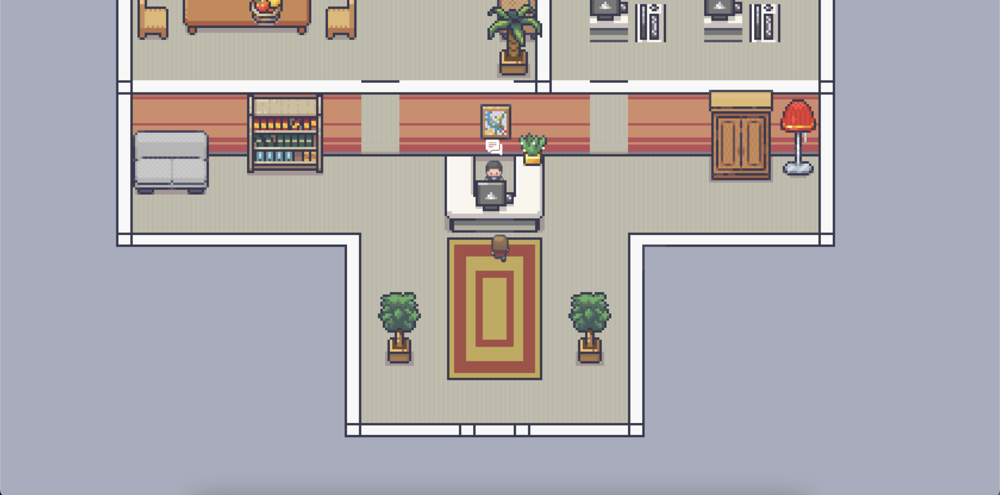

# Andrii Kycha Portfolio Inspired by 1990s Video Games



## Running Locally

- Clone the repo
- ```cd pixel-portfolio```
- ```npm run ci```
- ```npm run build```
- Open `static/index.html` in your browser

## Adding Changes

- ```npm run build -- --watch```
- Open `static/index.html` in your browser
- Add your changes to the codebase
- Reload the browser page to apply the changes

## Changing the Map

- Install the [Tiled map editor](https://www.mapeditor.org/)
- Open the app
- Open the Tiled project at `src/assets/tilesets/First Office.tmx`
- Add the changes